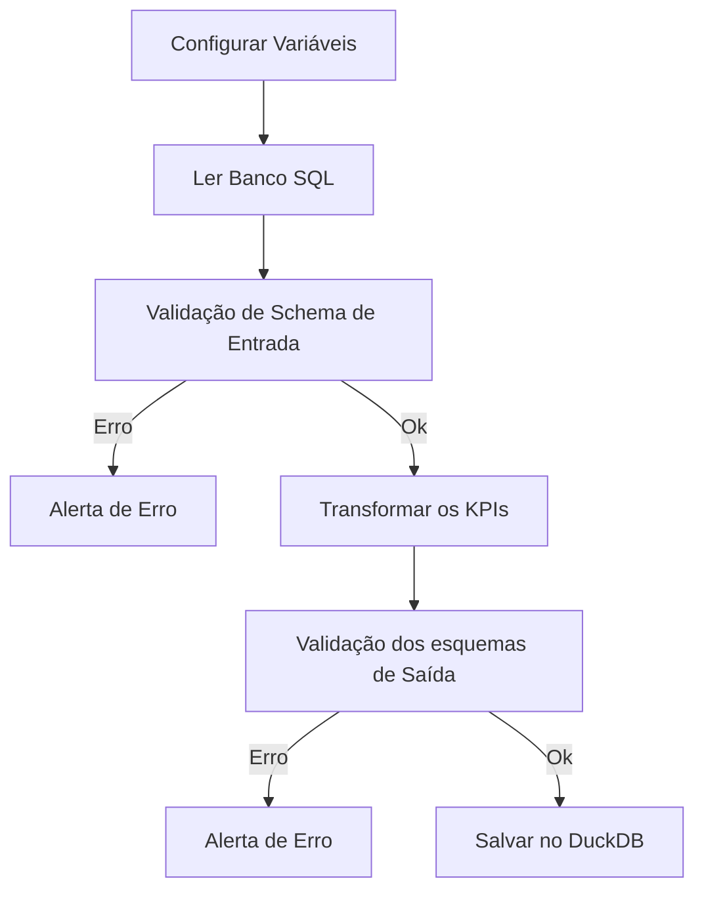

# Data Quality - Documentação

## Fluxo

Para desenvolver o projeto abaixo utilizaremos a seguinte ETL

```mermaid
graph TD;
    A[Configurar Variáveis] --> B[Ler Banco SQL]
    B --> C[Validação de Schema de Entrada]
    C -- Erro --> D[Alerta de Erro]
    C -- Ok --> E[Transformar os KPIs]
    E --> F[Validação dos esquemas de Saída]
    F -- Erro --> G[Alerta de Erro]
    F -- Ok --> H[Salvar no DuckDB]

```

## Contrato de Dados

::: app.schema_crm.schema_zeus